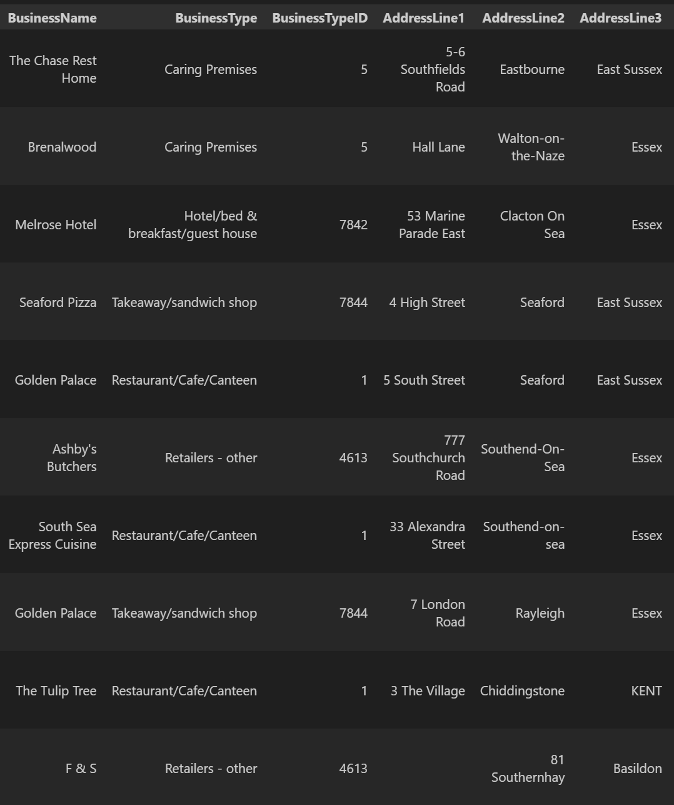

# nosql-challenge

## 1. Import JSON file using pymongo and update the database

Refer to `Resources/NoSQL_setup_starter.ipynb`

* Import the data `Resources/establishments.json` in terminal, creating database `uk_food` and collection `establishments`  
 Type in terminal:  

    ```bash
    mongoimport --type json -d uk_food -c establishments --drop --jsonArray establishments.json
    ```

### Results and analysis

* Add a new halal restaurant's details in a dictionary to the database using `insert_one`  
  

* Find the BusinessTypeID for "Restaurant/Cafe/Canteen" and return only the BusinessTypeID and BusinessType fields  
    `{'BusinessType': 'Restaurant/Cafe/Canteen', 'BusinessTypeID': 1}`

* Update the new restaurant with the correct BusinessTypeID using `update_one`  
    
* Find how many documents have LocalAuthorityName as "Dover", then delete those documents using `count_documents` and `delete_many`  
    `Number of documents where LocalAuthorityName = Dover:  994`  
    `Remaining documents where LocalAuthorityName = Dover:  0`
* Convert latitude and longitude to decimal datatype, RatingValue to integer datatype using `update_many`, `$toDecimal` and `$toInt`  
  

## 2. Exploratory Analysis

Refer to `Resources/NoSQL_analysis_starter.ipynb`

* Use `count_documents` to display the number of documents contained in the result.
* Display the first document in the results using `pprint`.
* Convert the result to a Pandas DataFrame, print the number of rows in the DataFrame, and display the first 10 rows.

### Results and analysis

1. Which establishments have a hygiene score equal to 20?  
There were 41 establishments that had a score of 20 - these are places to avoid due to poor hygiene!
  

2. Which establishments in London have a RatingValue greater than or equal to 4?  
Using `$regex` and `$gte`, it was found that there are 33 establishments in The London local authority with a rating >= 4. These establishments are rated highly for food hygiene by the Food Authority.  
  

3. What are the top 5 establishments with a RatingValue of 5, sorted by lowest hygiene score, nearest to the new restaurant added, "Penang Flavours"?  
Of the establishments that had a numerical hygiene score (i.e. score was not equal to None) that were within 0.01 degree of Penang Flavours, the top 5 businesses were:  
    
All these premises were highly rated for Food Hygiene with a score of 0.

4. How many establishments in each Local Authority area have a hygiene score of 0, sorting the results from highest to lowest?  
Using `$match`, `$group`, `$sort` and `aggregate`, it was found that the local authority area of Thanet had the highest number of establishments with top food hygiene ratings (hygiene score of 0), while the local authority areas of Sunderland, Reading, North Norfolk, Kensington and Chelsea, Dorset and Broxbourne only had 1 establishment with a food hygiene score of 0.  
    
  

## References

* [UK Food Standards Agency](https://www.food.gov.uk/) (2022). UK food hygiene rating data API. <https://ratings.food.gov.uk/open-data/en-GBLinks> to an external site.. Contains public sector information licensed under the [Open Government Licence v3.0](https://www.nationalarchives.gov.uk/doc/open-government-licence/version/3/) Accessed Sept 9, 2022 and Sept 12, 2022 with the establishment settings as follows: longitude=51.5072, latitude=-0.1276, maxdistancelimit=4567, pagesize=10000, sortoptionkey=distance, pagenumber=(1,2,3,4,5,6,7,8).
